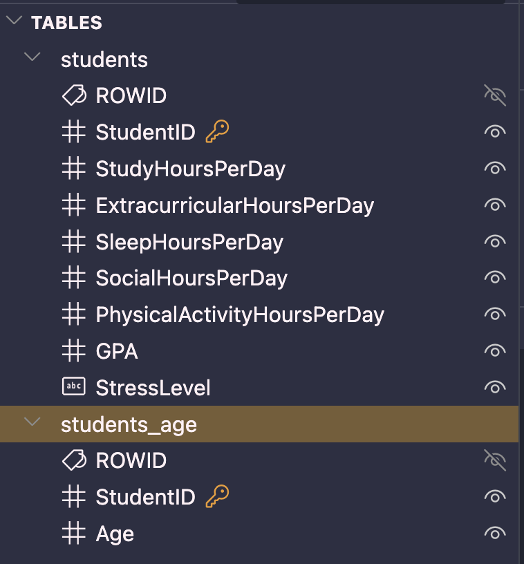
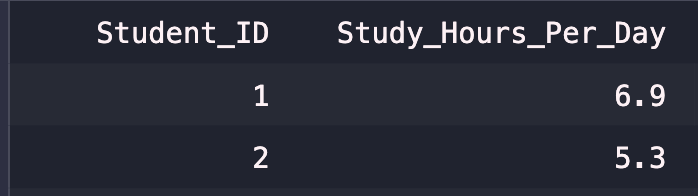
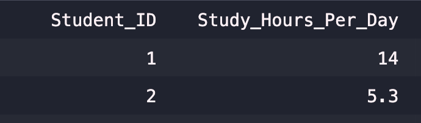
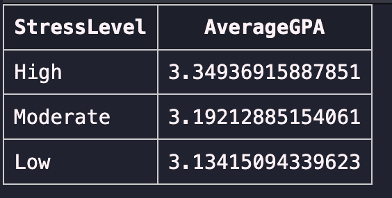
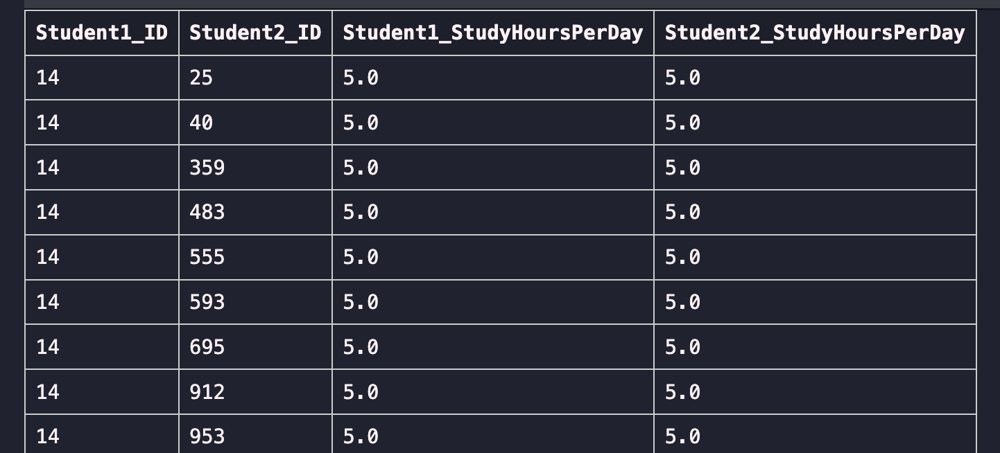
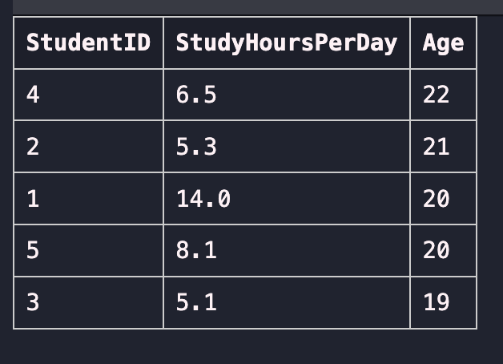
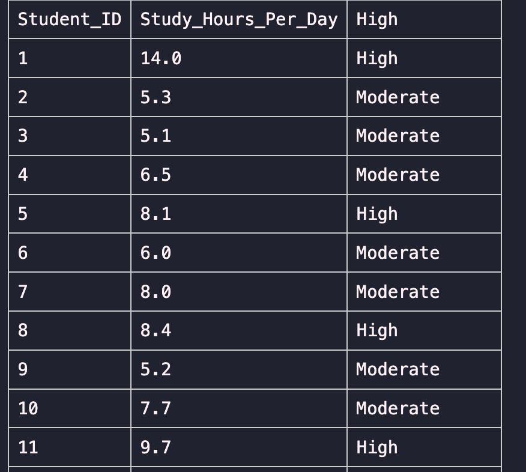
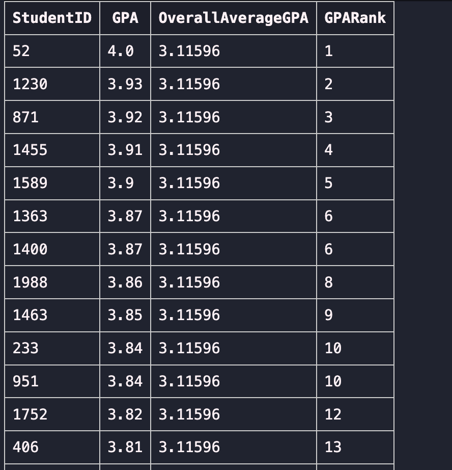
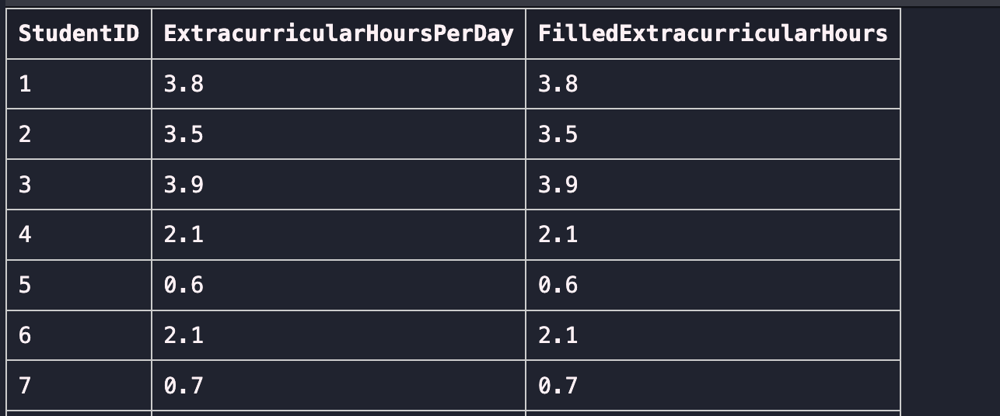
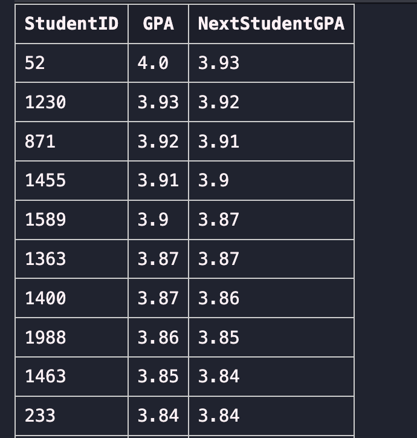

# Student Lifestyle SQL Guidebook
This project explores a dataset of students’ daily habits, such as study time, sleep, social life, and physical activity, to analyze their relationship with GPA and stress levels.

All queries were executed using SQLite in Visual Studio Code.

## Dataset Overview
Table 1: students

This table imports a Kaggle dataset for study habits and activities of students: https://www.kaggle.com/datasets/afnansaifafnan/study-habits-and-activities-of-students

About the data:
- Student ID : A unique identifier assigned to each student.
- Study Hours Per Day : Average number of hours in which a student spends time for studying daily.
- Extracurricular Hours Per Day : spending time on extra-cocurricular activities such as clubs, arts,sports, or other hobbies.
- Sleep Hours Per Day : Number of hours a student sleeps per day.
- Social Hours Per Day : Time spent with friends, family, or social interactions.
- Physical Activity Hours Per Day : Time spent in physical activities or exercise.
- GPA : Grade Point Average representing academic performance.
- Stress Level : Stress category of the student (Low, Moderate, High).

Table 2: students_age

This table uses 5 rows of sample data I created to represent some students and their ages, to use for later join examples. 


# Creating Tables
To create the tables, the schema and data types must be looked at and enforced.
```sql
CREATE TABLE students (
    StudentID INT PRIMARY KEY,
    StudyHoursPerDay FLOAT,
    ExtracurricularHoursPerDay FLOAT,
    SleepHoursPerDay FLOAT,
    SocialHoursPerDay FLOAT,
    PhysicalActivityHoursPerDay FLOAT,
    GPA FLOAT,
    StressLevel VARCHAR(10)
);
```
Design Highlights
- StudentID is the primary key, enforcing entity uniqueness.
- FLOAT data types capture continuous measures such as study and sleep hours.
- StressLevel uses a limited string type to capture categorical data (Low, Moderate, High).
- Each column reflects an atomic attribute, ensuring 1NF (First Normal Form) compliance.
Creates the main table to store the student lifestyle dataset.

```sql
CREATE TABLE students_age (
    StudentID INT PRIMARY KEY,
    Age INT CHECK (Age BETWEEN 15 AND 100),
    FOREIGN KEY (StudentID) REFERENCES students(StudentID)
);
```
Design Highlights
- Establishes a one-to-one relationship with the students table via StudentID.
- Adds demographic context without redundancy, demonstrating 2NF normalization.
- A FOREIGN KEY constraint enforces referential integrity between tables.
- The CHECK constraint validates realistic age ranges.
Creates a supplementary table linking each StudentID to an Age.


## Importing the CSV Dataset into SQLite
Data from Kaggle’s Student Lifestyle dataset was loaded using the SQLite CLI:
```bash
sqlite3 my_database.db
.mode csv
.separator ","
.import student_lifestyle_dataset.csv students
SELECT * FROM students LIMIT 5;
.exit
```

## Verifying Data 
```sql
SELECT * FROM students
LIMIT 5;
```
Displays all records to confirm the data loaded correctly.
```
Student_ID,Study_Hours_Per_Day,Extracurricular_Hours_Per_Day,Sleep_Hours_Per_Day,Social_Hours_Per_Day,Physical_Activity_Hours_Per_Day,GPA,Stress_Level
1,6.9,3.8,8.7,2.8,1.8,2.99,Moderate
2,5.3,3.5,8.0,4.2,3.0,2.75,Low
3,5.1,3.9,9.2,1.2,4.6,2.67,Low
4,6.5,2.1,7.2,1.7,6.5,2.88,Moderate
```

## Updating Data
```sql
UPDATE students
SET StudyHoursPerDay = 14.0
WHERE StudentID = 1;
```
Updates the study hours to 14.0 for the student with ID 1.

Used to demonstrate UPDATE statements for modifying specific records.

Before Update:

After Update:


## Aggregations & Filtering (SELECT, WHERE, GROUP BY, HAVING, ORDER BY, LIMIT)
Question:

What is the average GPA of students with GPA > 3.0, grouped by stress level, limited to the top 3 stress levels with the highest average GPA?

```sql
SELECT StressLevel, AVG(GPA) AS AverageGPA
FROM students
WHERE GPA > 3.0
GROUP BY StressLevel
HAVING AVG(GPA) > 3.0
ORDER BY AverageGPA DESC
LIMIT 3;
```
Demonstrates GROUP BY, HAVING, and aggregate functions (AVG) combined with filtering and ordering.



## Joins (Inner Join and Self Join)
a. Self Join – Compare Students with Equal Study Hours

Question: 

Which pairs of students have the same study hours per day?

```sql
SELECT s1.StudentID AS Student1_ID,
       s2.StudentID AS Student2_ID,
       s1.StudyHoursPerDay AS Student1_StudyHoursPerDay,
       s2.StudyHoursPerDay AS Student2_StudyHoursPerDay
FROM students s1
INNER JOIN students s2
  ON s1.StudyHoursPerDay = s2.StudyHoursPerDay
 AND s1.StudentID != s2.StudentID
ORDER BY s1.StudyHoursPerDay ASC, s2.StudyHoursPerDay DESC;
```
Finds pairs of students with identical daily study hours.



b. Inner join with `students_age`
```sql
SELECT s.StudentID, s.StudyHoursPerDay, sa.Age
FROM students s
INNER JOIN students_age sa
  ON s.StudentID = sa.StudentID
ORDER BY sa.Age DESC;
```

Combines data from both tables to display some students' study hours alongside their age. Only includes students that have data in the students_age table.

# Data Cleaning and Transformation (CASE WHEN, DELETE)
a. Categorizing Study Hours

Question: 

How can we categorize students into ‘Low,’ ‘Moderate,’ and ‘High’ study hours?
```sql
SELECT StudentID,
       StudyHoursPerDay,
       CASE
         WHEN StudyHoursPerDay < 4 THEN 'Low'
         WHEN StudyHoursPerDay BETWEEN 4 AND 8 THEN 'Moderate'
         ELSE 'High'
       END AS StudyCategory
FROM students;
```

Creates a new categorical label `StudyCategory` based on numerical study hours.


b. Deleting Invalid Records
```sql
DELETE FROM students
WHERE GPA < 0 OR GPA > 4;
```
Removes any records with unrealistic GPA values.

## Window Functions and CTEs 
Question:

What is each student’s GPA along with the overall average GPA and their rank based on GPA?
```sql
WITH AverageGPA AS (
    SELECT StudentID, GPA,
           AVG(GPA) OVER () AS OverallAverageGPA
    FROM students
)
SELECT StudentID, GPA, OverallAverageGPA,
       RANK() OVER (ORDER BY GPA DESC) AS GPARank
FROM AverageGPA;
```
Uses a Common Table Expression (CTE) and window functions (AVG OVER(), RANK) to compute rankings and overall averages.



## Handling Missing Values with COALESCE
Question:

How can we replace NULL values in ExtracurricularHoursPerDay with the column’s average value?
```sql
SELECT 
    StudentID,
    ExtracurricularHoursPerDay,
    COALESCE(
        ExtracurricularHoursPerDay,
        (SELECT AVG(ExtracurricularHoursPerDay) FROM students)
    ) AS FilledExtracurricularHours
FROM students;

```


The COALESCE function substitutes nulls with a default—in this case, the average extracurricular hours.

## Comparing Rows with LEAD
Question:

What is each student’s GPA along with the GPA of the next student (ordered descending by GPA)?

```sql
SELECT StudentID, GPA,
       LEAD(GPA) OVER (ORDER BY GPA DESC) AS NextStudentGPA
FROM students;
```
Uses the LEAD() window function to compare adjacent rows (students) and observe differences between consecutive GPAs.


